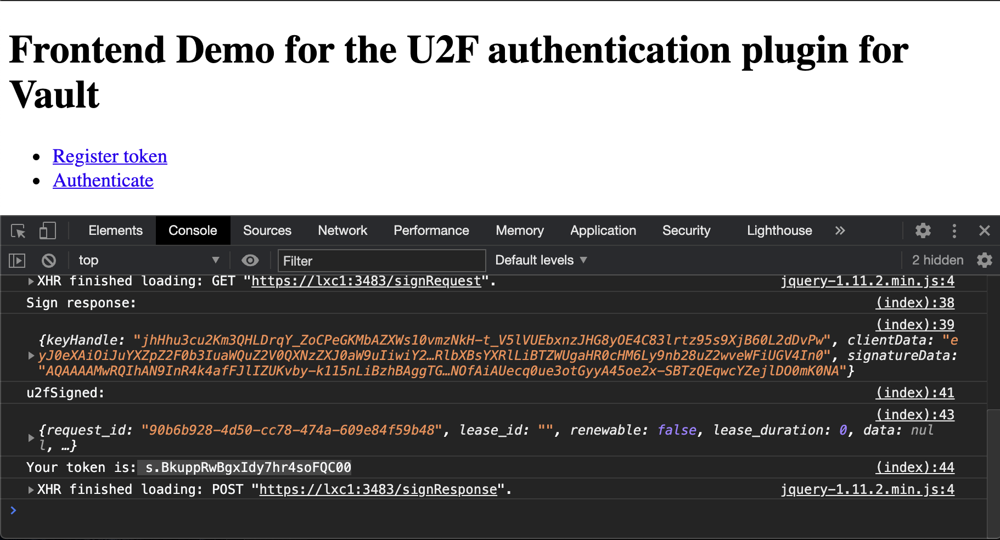

# vault-plugin-auth-u2f
This is non official plugin for HashiCorp Vault that uses a FIDO U2F enabled device as way to authenticate a human.

It works by assigning a role to a device when an administrator registers it.

It currently support the web browser implementation of the U2F protocol from Google https://github.com/google/u2f-ref-code/blob/master/u2f-gae-demo/war/js/u2f-api.js

It uses the u2f for Go library by Ryan Kurte: https://github.com/ryankurte/go-u2f


# Roles

Roles must be created to associate a set of policies to a token created for a device:

```
$ vault write auth/u2f/roles/my-role token_policies="polA,polB"
```
# Registrations

Registration of new devices is done by a POST to the endpoint `auth/<u2f>/registerRequest/<mydevice>` with the payload of `role_name: <my-role>` as json.

Finishing with another POST to `auth/<u2f>/registerResponse` with a payload of the protocol data signed by the device when the user presses the physical button.

See the demo in the directory u2f-frontend.

These endpoints should be protected for writting and only given access to admistrators.

# Authentication
This is done via the endpoints `auth/<u2f>/signRequest` and `auth/<u2f>/signResponse` with appropiate protocol data as payload.

# Demo

* In the directory u2f-frontend you will find a shell script that will start Vault in dev mode and load the plugin:
``` 
$ make 
$ cd u2f-frontend
$ ./start_vault.sh
+ set +e
++ pidof vault
+ kill -TERM 236661
+ export VAULT_ADDR=http://127.0.0.1:8200
+ VAULT_ADDR=http://127.0.0.1:8200
+ unset VAULT_TOKEN
+ sleep 3s
+ /usr/local/bin/vault server -dev -dev-listen-address=0.0.0.0:8200 -dev-root-token-id=root -dev-plugin-dir=../plugins -log-level=trace
+ vault auth enable u2f
Success! Enabled u2f auth method at: u2f/
+ sleep 1s
+ vault write auth/u2f/roles/my-role token_policies=polA,polB
Success! Data written to: auth/u2f/roles/my-role
+ sleep 1s
+ vault read auth/u2f/roles/my-role
Key                        Value
---                        -----
token_bound_cidrs          []
token_explicit_max_ttl     0s
token_max_ttl              0s
token_no_default_policy    false
token_num_uses             0
token_period               0s
token_policies             [polA polB]
token_ttl                  0s
token_type                 default
```

This creates a role that assigns two policies to any device that is registered with it.

* Start the frontend UI

```
$ ./u2f-frontend
2020/10/20 15:21:36 Running on https://localhost:3483

postPasstrough data: { "role_name": "my-role"}
postPasstrough returned: {"appId":"https://lxc1:3483","registerRequests":[{"version":"U2F_V2","challenge":"ney1ncntfiOH6RR9L51Tg_YgnBQOc-4pGb6DvDK3sYM","appId":"https://lxc1:3483"}],"registeredKeys":null}
2020/10/20 15:23:56 1 registerRequest: {"appId":"https://lxc1:3483","registerRequests":[{"version":"U2F_V2","challenge":"ney1ncntfiOH6RR9L51Tg_YgnBQOc-4pGb6DvDK3sYM","appId":"https://lxc1:3483"}],"registeredKeys":null}
2020/10/20 15:24:01 registerResponse regResp: {BQRB..WxzZX0}
postPasstrough data: {"clientData":"eyJ0eXAiO..JTxHP79SNhWc9JYtYT8U","name":"mydevice"}
postPasstrough returned: {"ok"}
2020/10/20 15:24:01 Registration success
2020/10/20 15:25:49 1 signRequest: {"appId":"https://lxc1:3483","challenge":"vAgX_uthFHN56nUdt6PTkWg3XY1nsJds5aBJH2ZVBuQ","registeredKeys":[{"version":"U2F_V2","keyHandle":"jhHhu3cu2Km3QHLDrqY_ZoCPeGKMbAZXWs10vmzNkH-t_V5lVUEbxnzJHG8yOE4C83lrtz95s9XjB60L2dDvPw"}]}
2020/10/20 15:25:51 signResponse: {KeyHandle:jhHhu3cu..FiUGV4In0}
postPasstrough data: {"keyHandle":"jh..V4In0","name":"mydevice"}
postPasstrough returned: {"request_id":"90b6b928-4d50-cc78-474a-609e84f59b48","lease_id":"","renewable":false,"lease_duration":0,"data":null,"wrap_info":null,"warnings":null,"auth":{"client_token":"s.BkuppRwBgxIdy7hr4soFQC00","accessor":"e5xVaunuBVdLHA7f5D3jr0us","policies":["default","pola","polb"],"token_policies":["default","pola","polb"],"metadata":{"device_name":"mydevice","role":"my-role"},"lease_duration":2764800,"renewable":true,"entity_id":"8977a412-c7ad-1e03-f654-b91bfd30a6b3","token_type":"service","orphan":true}}
2020/10/20 15:25:51 Authentication success
```

* Go to a browser to https://localhost:3483


* Click in Register token and press the button in your device
* Click in Authenticate and press the button in your device

The token that you receive will have the policies attached that your role was assigned at the begining:

```
$ vault token lookup  s.BkuppRwBgxIdy7hr4soFQC00
Key                 Value
---                 -----
accessor            e5xVaunuBVdLHA7f5D3jr0us
creation_time       1603200351
creation_ttl        768h
display_name        u2f-u2f_mydevice
entity_id           8977a412-c7ad-1e03-f654-b91bfd30a6b3
expire_time         2020-11-21T14:25:51.27807041+01:00
explicit_max_ttl    0s
id                  s.BkuppRwBgxIdy7hr4soFQC00
issue_time          2020-10-20T15:25:51.278108041+02:00
meta                map[device_name:mydevice role:my-role]
num_uses            0
orphan              true
path                auth/u2f/signResponse/mydevice
*policies            [default pola polb]*
renewable           true
ttl                 767h59m34s
type                service
```

# License 
Mozilla Public License Version 2.0

Created by Rodrigo A. Diaz Leven
